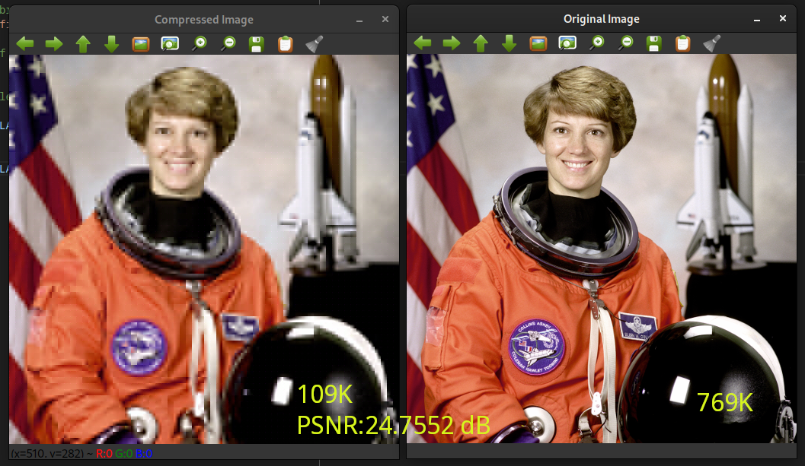

# Image Compressor

This is a simple implementation of a lossy image compressor. It is inspired by
JPEG. As JPEG the image is decomposed into square blocks and transformed with
a Discrete Cosine Transform (DCT) and high frequencies are discarded. The image
is transformed to YCrCb color space before compression.

It doesn't really outperforms any image saving method but my goal was to learn
about openCV and saving and loading files in C++.

## Usage

Build with `make`

To compress an image run `./img-compressor input_image_path output_image_path
-num-freq=2 -block-size=8` If the output_path ends in `.cmp` a compressed image
is saved. If it ends in `.raw` a direct uncompressed image is saved. If you run
only with one path is giving the image is decoded and displayed.

## Areas for improvement

- Add support for image sizes that are not integer multiple of the block size
- Allow for different resolutions per channel.